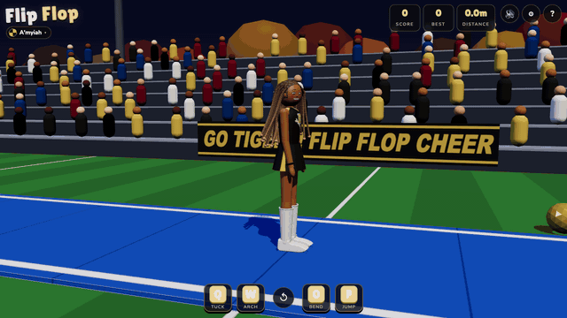
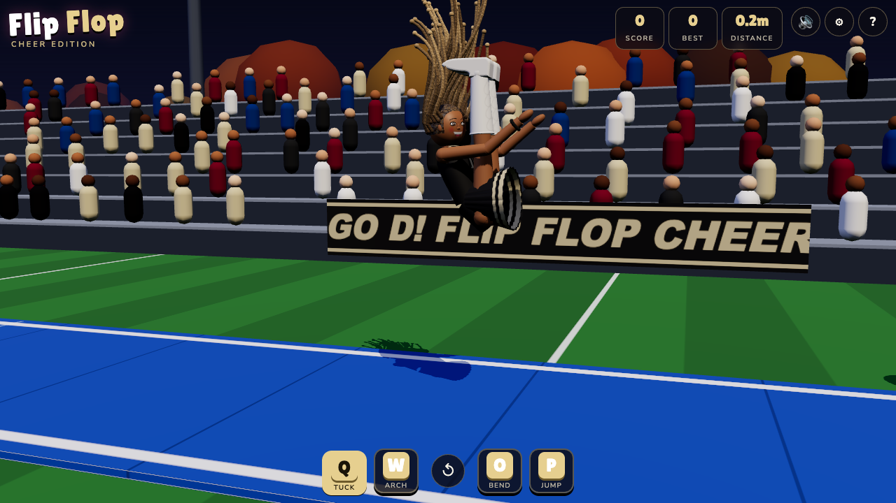
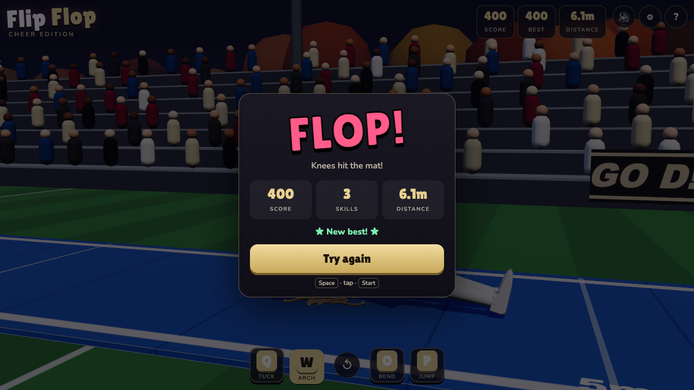
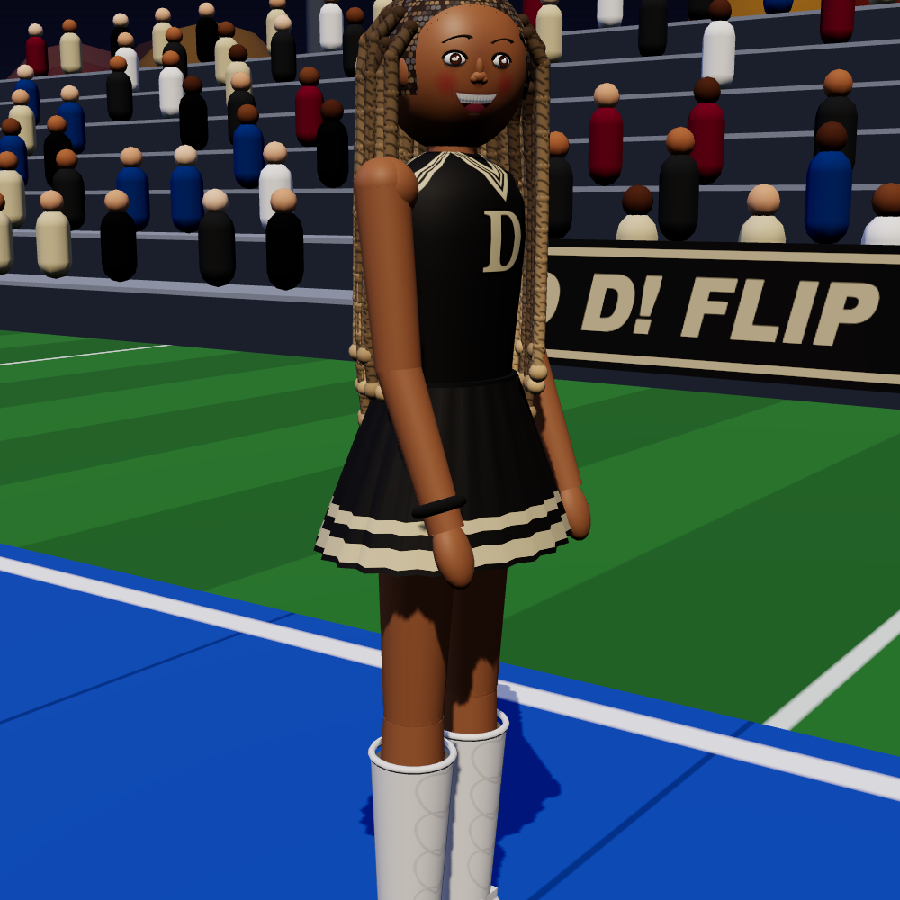
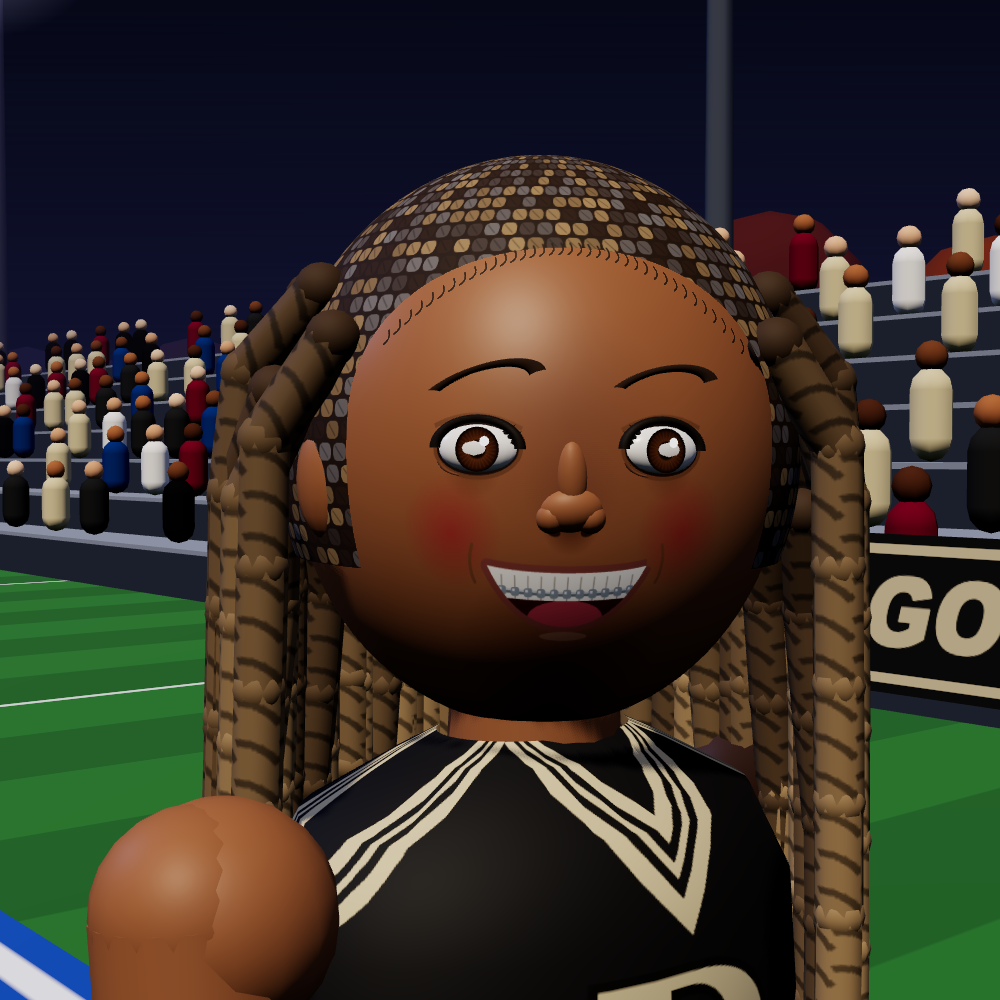
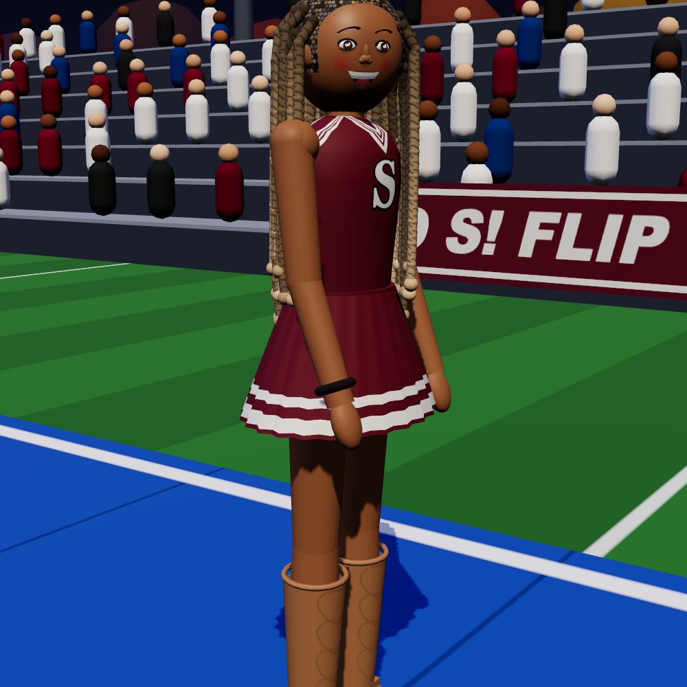
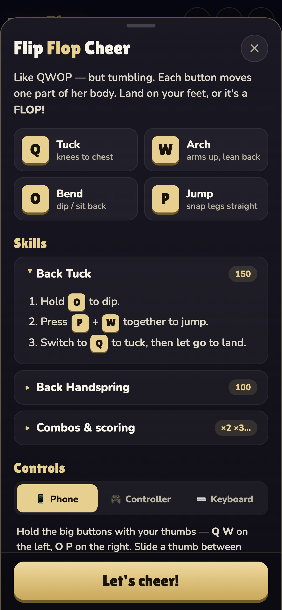
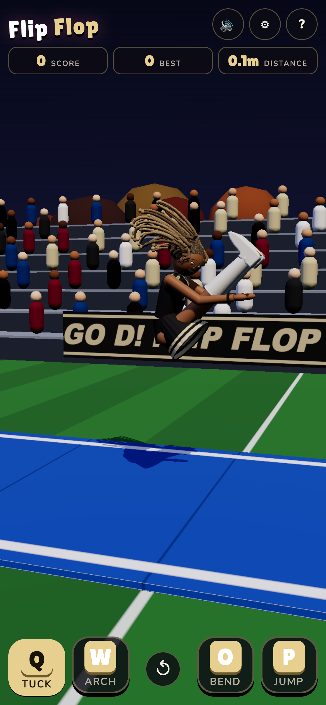
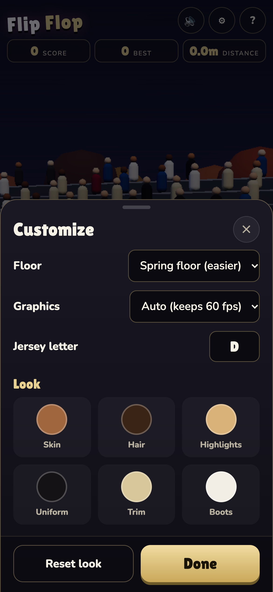

# Flip Flop Cheer

**A QWOP-style cheer tumbling game.** You control a cheerleader's hips, arms
and legs one key at a time. Land back tucks and back handsprings on your
feet, chain them into combos, or… **FLOP!**

### ▶ Play it: **[flip-flop-cheer.vercel.app](https://flip-flop-cheer.vercel.app)**
Works on desktop, phones and tablets (touch), and with game controllers.

<p align="center">
  
  <br />
  <sub>Back tuck → back handspring → “Stuck it!” → back handspring → back tuck → FLOP.
  <a href="docs/media/demo.mp4">Watch the full-quality video (MP4)</a>.</sub>
</p>

---

## What it does

| | |
| --- | --- |
|  |  |
| **Real physics tumbling.** The gymnast is a ragdoll driven by joint motors (planck.js / Box2D). Q W O P each move one body part: you have to time the dip, jump, tuck and landing yourself. | **Falls are part of the fun.** Touch the mat with anything but your feet or hands and it's a FLOP. You get a run summary with score, skills, distance and personal best. |

- **Skills recognized automatically:** Back Tuck, Back Pike, Back Layout,
  Back Handspring, Back Walkover, front variants, doubles and triples.
- **Combos:** chain skills back-to-back and each one multiplies its points.
  Stand still after landing to **stick it** (+50) and bank the combo.
- **Two floors:** *Spring floor* (assisted, the default) and *Gym floor*
  (expert, closer to classic QWOP).
- **A living stadium:** Friday-night-lights field with a cheer mat, distance
  markers and a crowd that jumps up when you land something.
- **Sound effects:** synthesized in the browser, so there are no audio files to load.

### The gymnast

| | | |
| --- | --- | --- |
|  |  |  |
| Black & gold cheer uniform, white western boots. | Sculpted face with a braces smile, and long box braids (simulated, so they whip around during flips). | Fully customizable: skin, hair, highlights, uniform, trim, boots and jersey letter. |

### On your phone

| | | |
| --- | --- | --- |
|  |  |  |
| A how-to-play sheet with step-by-step skill recipes. | Big thumb buttons: Q W on the left, O P on the right. Slide your thumb between them. | Customize the floor, graphics and look. |

---

## Controls

| Key | Move | What it does |
| :---: | --- | --- |
| **Q** | Tuck | knees to chest, arms to shins |
| **W** | Arch | arms overhead, open hips, lean back |
| **O** | Bend | dip / sit back |
| **P** | Jump | snap legs straight, point toes |

- **Phone / tablet:** hold the on-screen buttons; ↺ restarts.
- **Controller:** LB/X = Q · LT/Y = W · RB/A = O · RT/B = P · Start = restart · Back = help.
  The sticks work too (left stick up/down = W/Q, right stick up/down = P/O), and falls trigger rumble.
- **Keyboard:** Q W O P · R or Space = restart · H = help · F = FPS meter.

### Skill recipes

**Back Tuck:** hold **O** to dip → press **P + W** together to jump → switch to
**Q** to tuck → let go to open up and land.

**Back Handspring:** hold **O**, add **W** and lean back (~½ s) → **P + W** to
jump onto your hands → tap **Q** the moment your hands touch → let go to land.

---

## Performance

The game aims to hold **60 fps on any device**:

- **Adaptive quality:** it measures real frame times and steps down render
  resolution and shadow quality when frames run slow. It probes back up when
  there's headroom, and remembers tiers that failed so it doesn't bounce
  between them. You can also pin High / Medium / Low in ⚙.
- **Fixed physics timestep:** physics runs at 120 Hz with a per-frame step cap,
  so a slow frame causes a moment of slow motion instead of a growing lag.
- **Instancing:** the crowd, trees, stadium lights and mat lines are each a
  single instanced draw call. The crowd only animates while it's cheering.
- **Lighter background:** background objects use cheaper Lambert materials,
  tiny face details don't cast shadows, and MSAA is skipped on high-DPI phones.

## Development

```bash
npm install
npm run dev      # http://localhost:5173 (reachable from phones on your Wi-Fi)
npm run build    # production build in dist/
```

### Tools

`tools/` holds headless Node scripts used to tune the physics and record media:

```bash
node tools/search.mjs soft tuck   # grid-search key timings that land a back tuck
node tools/bhs2.mjs soft          # same for back handsprings (reactive timing)
node tools/demo.mjs               # validate the scripted demo run
npm run build && node tools/capture.mjs   # re-record docs/media (needs Chrome + ffmpeg)
```

`capture.mjs` uses the game's `?capture` mode, which runs on a simulated clock
so the recorded video is perfectly smooth no matter how slowly the headless
browser renders.

### Code map

| File | What's in it |
| --- | --- |
| `src/ragdoll.js` | 2D ragdoll, joint motors, balance and spring-floor assists |
| `src/skills.js` | skill recognition, combos, scoring, falls |
| `src/character.js` | the 3D gymnast: uniform, skirt, boots, limbs |
| `src/face.js` | sculpted face, painted details, hair cap |
| `src/hair.js` | verlet-simulated box braids |
| `src/stage.js` | stadium, mat, crowd, lights |
| `src/input.js` | keyboard, multi-touch and gamepad input |
| `src/quality.js` | adaptive quality controller |
| `src/main.js` | game loop, camera, UI, capture mode |

Built with [Three.js](https://threejs.org), [planck.js](https://piqnt.com/planck.js/) and [Vite](https://vite.dev).
